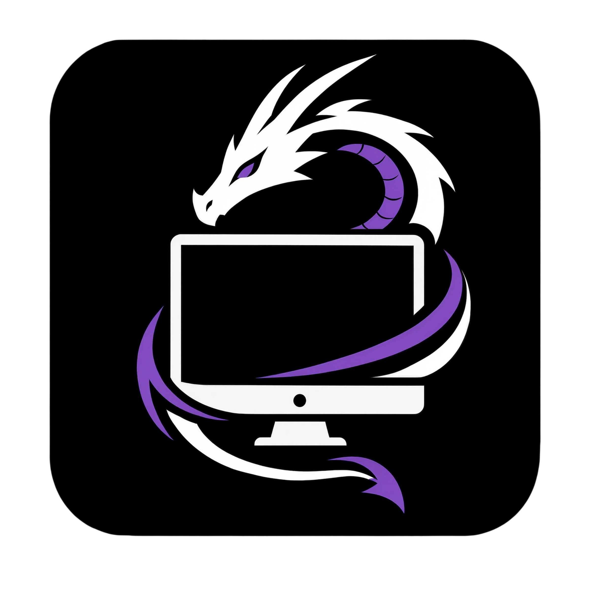
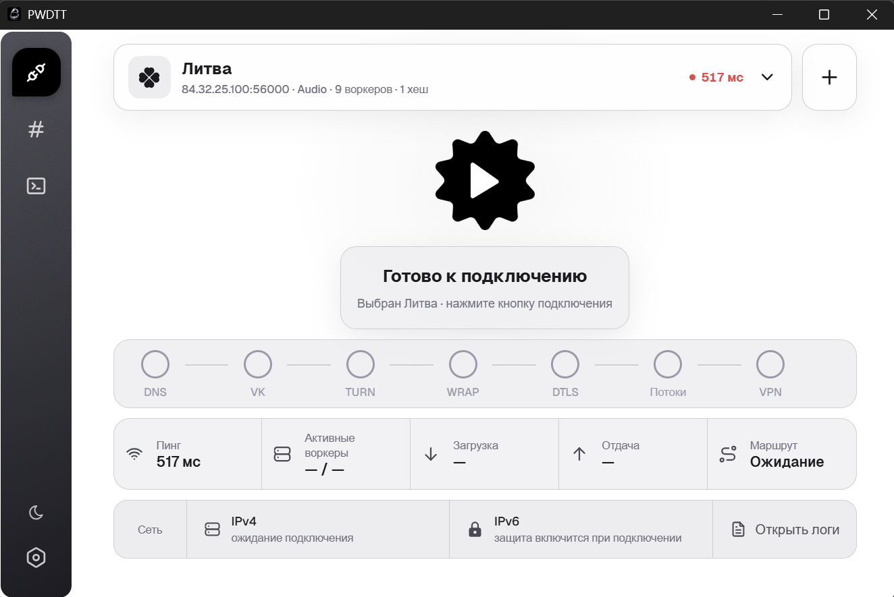
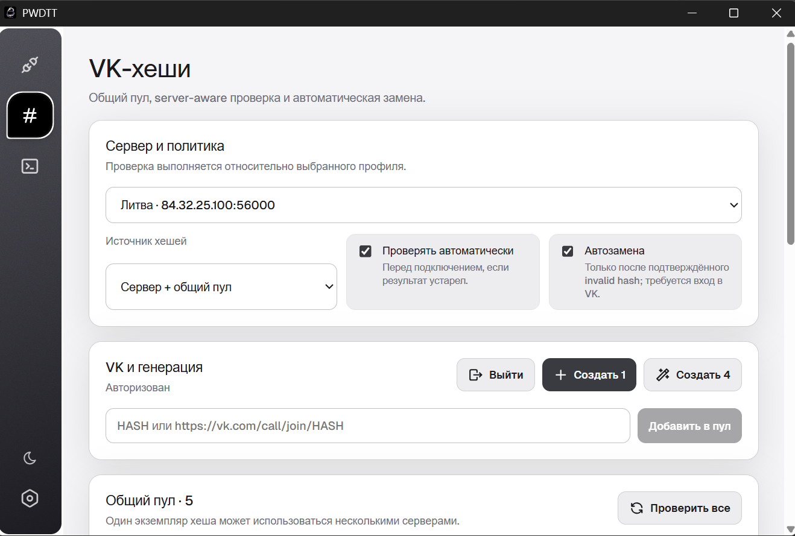
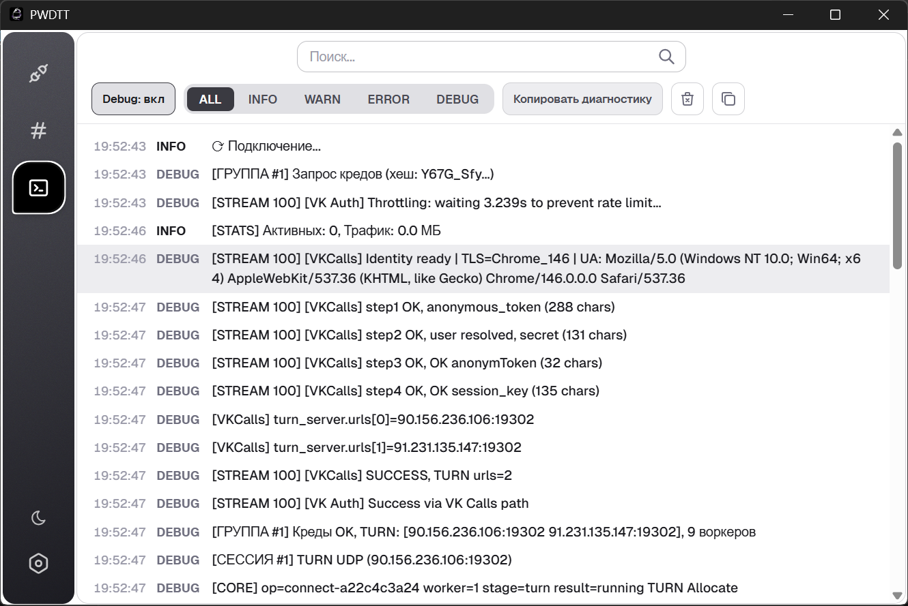

<div align="center">



# PWDTT

Десктопный клиент для туннелирования трафика через TURN/DTLS-инфраструктуру VK с локальным WireGuard-интерфейсом. Репозиторий развивается как поддерживаемый форк [luminescq/PWDTT](https://github.com/luminescq/PWDTT) с совместимостью с актуальной инфраструктурой WDTT/qWDTT.

[](../../releases)
[](../../actions/workflows/build.yml)
[](#требования)
[](LICENSE)

[Быстрый старт](#быстрый-старт) ·
[Документация](#документация) ·
[Релизы](../../releases) ·
[Обратная связь](../../issues)

</div>

---

## О проекте

PWDTT поднимает локальный WireGuard-интерфейс и передаёт его трафик через VK TURN/DTLS, оборачивая пакеты в RTP с шифрованием ChaCha20-Poly1305. Для выхода в интернет используется настроенный пользователем `wdtt-server`.

```text
Приложение → WireGuard → ChaCha20-Poly1305/RTP → VK TURN/DTLS → wdtt-server → интернет
```

Проект предназначен для пользователей существующей инфраструктуры WDTT/qWDTT, которым нужен desktop-клиент для Windows, Linux или macOS.

## Статус проекта

PWDTT активно развивается как независимый поддерживаемый форк `luminescq/PWDTT`. Последний стабильный релиз — [v1.8.0](../../releases/tag/v1.8.0).

В форке поддерживается собственный release-канал `Regstar2/pwdtt`, а изменения upstream и форка рассматриваются отдельно. Текущие задачи и известные проблемы ведутся в [GitHub Issues](../../issues).

## Возможности

- локальный WireGuard-туннель с транспортом через VK TURN/DTLS;
- RTP-обёртка с ChaCha20-Poly1305;
- профили серверов, импорт `wdtt://` и поддержка qWDTT-ссылок;
- ручное добавление и централизованное управление VK call hashes;
- автоматическое создание VK call hashes на Windows через авторизацию VK;
- функциональная проверка хешей по цепочке VK → TURN → WRAP → DTLS;
- connection dashboard с этапами подключения, воркерами, трафиком, задержкой и состоянием IPv4/IPv6;
- TURN failover и распределение worker-сессий между доступными endpoint;
- Windows-защита от IPv6 leak для IPv4 full-tunnel;
- встроенный диагностический отчёт и журнал текущей сессии;
- Windows installer и portable-сборка, Linux amd64 и macOS Universal;
- проверка обновлений через официальный release-канал форка.

## Скриншоты

### Главное окно

<p align="center">
  
</p>

### Управление VK-хешами

<p align="center">
  
</p>

### Логи и диагностика

<p align="center">
  
</p>

## Быстрый старт

1. Откройте [Releases](../../releases) и скачайте сборку для своей платформы. Для Windows рекомендуется `pwdtt-windows-amd64-setup.exe`.
2. Установите или запустите PWDTT.
3. Добавьте сервер кнопкой `+`: вставьте `wdtt://`-ссылку или заполните параметры вручную.
4. Добавьте VK call hashes вручную либо на Windows создайте их через встроенную авторизацию VK.
5. Выберите сервер и запустите подключение. На Windows подтвердите штатный UAC-запрос, когда приложение перейдёт к настройке WireGuard и маршрутов.

Для работы нужен собственный настроенный WDTT/qWDTT-сервер. PWDTT не предоставляет удалённый сервер автоматически.

## Требования

### Windows

- Windows x86-64 для готовой Windows-сборки;
- доступ к настроенному WDTT/qWDTT-серверу;
- рабочие VK call hashes либо возможность создать их из приложения;
- Microsoft Edge для автоматической авторизации VK;
- возможность подтвердить UAC при создании WireGuard-интерфейса и изменении маршрутов/firewall.

GUI работает без постоянного elevation. Повышенные права запрашиваются отдельным privileged helper только для системной сетевой настройки.

### Linux

Для готовой Linux amd64-сборки нужны WireGuard tools и WebKitGTK 4.1. На Debian/Ubuntu:

```bash
sudo apt install wireguard-tools libayatana-appindicator3-dev pkg-config gcc libwebkit2gtk-4.1-dev
```

Управление сетевым интерфейсом требует повышенных прав.

### macOS

Публикуется Universal-сборка. Создание сетевого интерфейса и маршрутов требует административных прав.

## Установка

### Windows

Рекомендуемый вариант — `pwdtt-windows-amd64-setup.exe`. Installer устанавливает PWDTT для текущего пользователя в `%LOCALAPPDATA%\Programs\PWDTT`, поддерживает установку поверх предыдущей версии и штатное удаление.

`pwdtt-windows-amd64.exe` остаётся официальным portable-вариантом без установки.

### Linux и macOS

Скачайте соответствующий артефакт из [GitHub Releases](../../releases):

- Linux: `pwdtt-linux-amd64`;
- macOS: `PWDTT-macos.zip`.

Каждый release содержит `SHA256SUMS` для проверки опубликованных payload-файлов.

## Использование

### Ссылки серверов

Формат `wdtt://`:

```text
wdtt://<IP>:<DTLS_PORT>:<WG_PORT>:<PROXY_PORT>:<PASSWORD>[:<HASH1>,<HASH2>,...][#название]
```

Поля 1–5 обязательны. Хеши передаются через запятую; поддерживается до четырёх значений. `#название` задаёт необязательный псевдоним профиля.

Пример:

```text
wdtt://1.2.3.4:56000:56001:0:mypassword:AbCdEfGh,XyZ12345#Мой сервер
```

Ссылку можно вставить через кнопку `+` или `Ctrl+V` в окне приложения. Поддерживаются также qWDTT-ссылки.

### VK call hashes

Ручной ввод работает на всех платформах: можно указать hash или полную ссылку `vk.com/call/join/<hash>`.

На Windows PWDTT умеет создавать VK-звонки из окна управления хешами. Авторизация выполняется через отдельный профиль Microsoft Edge; access token остаётся в Go backend и не передаётся в React.

## Архитектура

PWDTT состоит из Go backend и интерфейса Wails/React. Сетевой путь разделён на локальный WireGuard-интерфейс, worker-соединения через VK TURN/DTLS и удалённый `wdtt-server`.

```text
┌──────────────┐    WireGuard    ┌──────────────┐
│ Приложения   │ ──────────────► │    PWDTT     │
└──────────────┘                 └──────┬───────┘
                                       │ RTP / ChaCha20-Poly1305
                                       ▼
                                ┌──────────────┐
                                │ VK TURN/DTLS │
                                └──────┬───────┘
                                       │
                                       ▼
                                ┌──────────────┐
                                │ wdtt-server  │ ──► интернет
                                └──────────────┘
```

## Безопасность

- Windows GUI не требует постоянного запуска от имени администратора; elevation используется только для минимального privileged helper.
- При отказе от UAC подключение отменяется, а приложение не переходит в ложное состояние VPN.
- VK access token остаётся в Go backend; локальное VK-состояние на Windows защищается через DPAPI.
- Release pipeline поддерживает Authenticode-подпись Windows-сборок и явно фиксирует unsigned fallback, если release-сертификат не настроен.
- Для всех публикуемых payload-файлов генерируется `SHA256SUMS`.

## Диагностика

Если соединение работает некорректно:

1. Откройте настройки PWDTT.
2. Создайте диагностический отчёт кнопкой `Отчёт`.
3. Откройте [Issue](../../issues/new) и приложите отчёт вместе с шагами воспроизведения.

Отчёт содержит сведения о системе, версии приложения, модели Windows elevation и логи текущей сессии. Перед публикацией проверьте его содержимое и удалите данные, которые не хотите размещать публично.

## Обновление

PWDTT проверяет последний stable release в [GitHub Releases](../../releases). Release-сборки получают версию из Git tag `vX.Y.Z`; локальная сборка имеет версию `dev`.

Если доступна более новая совместимая версия, приложение показывает changelog и предлагает открыть официальный asset в браузере. PWDTT не скачивает, не заменяет и не запускает новый бинарник автоматически.

Архитектура update flow описана в [ADR 0001](docs/adr/0001-update-delivery.md).

## Сборка

Зависимости для разработки:

- Go 1.26+;
- Node.js 22+;
- Wails v2.13.0.

```bash
git clone https://github.com/Regstar2/pwdtt.git
cd pwdtt
go install github.com/wailsapp/wails/v2/cmd/wails@v2.13.0
```

Linux amd64:

```bash
wails build -platform linux/amd64 -tags webkit2_41 -o pwdtt-linux-amd64
```

Windows amd64:

```bash
wails build -platform windows/amd64 -o pwdtt-windows-amd64.exe
```

macOS Universal:

```bash
wails build -platform darwin/universal -o pwdtt-macos
```

Обычная локальная сборка имеет runtime version `dev`. Release version передаётся CI через `-ldflags` из Git tag.

## Тестирование

Основные проверки, которые выполняет CI:

```bash
go test -count=1 ./...
cd core && go test -race -count=1 ./...
cd ../frontend && npm ci && npm test && npm run lint && npm run build
```

Кроме этого, release workflow проверяет PowerShell release helpers, Windows packaging, Authenticode helper, установку/обновление/удаление installer и финальный набор release artifacts.

## Документация

- [GitHub Releases](../../releases) — готовые сборки и release notes.
- [ADR 0001: доставка обновлений](docs/adr/0001-update-delivery.md) — release channel, version source и безопасный update flow.
- [Windows release guide](docs/windows-release.md) — installer, Authenticode, unsigned fallback и SHA-256.
- [Проверка IPv6 leak на Windows](docs/windows-ipv6-leak-check.md) — ручная проверка IPv6-защиты.
- [VK OAuth](docs/vk-oauth.md) — технические детали авторизации VK.
- [GitHub Issues](../../issues) — текущие задачи и известные проблемы.

## Обратная связь

Для ошибок и предложений используйте [GitHub Issues](../../issues). Для проблем подключения укажите платформу, воспроизводимые шаги и приложите диагностический отчёт из приложения.

## Происхождение и благодарности

`Regstar2/pwdtt` является GitHub-форком [luminescq/PWDTT](https://github.com/luminescq/PWDTT). Upstream PWDTT создан как desktop-адаптация [amurcanov/proxy-turn-vk-android](https://github.com/amurcanov/proxy-turn-vk-android).

Общие исправления по возможности могут отправляться обратно в upstream; дополнительные функции, исправления и релизы этого форка ведутся независимо.

## Ограничения

- Для работы нужен собственный настроенный WDTT/qWDTT-сервер и рабочие VK call hashes.
- Работа зависит от внешней инфраструктуры VK и протокола qWDTT; их изменения могут потребовать обновления клиента.
- Автоматическое создание VK call hashes доступно на Windows и требует Microsoft Edge; ручной ввод сохраняется на всех поддерживаемых платформах.
- Набор готовых бинарных файлов определяется конкретным release.
- Update flow не выполняет автоматическую замену бинарника: приложение только открывает официальный release asset.
- Проект не является официальным продуктом VK.

> [!IMPORTANT]
> PWDTT — технический инструмент для туннелирования собственного трафика через настроенный пользователем сервер. Пользователь самостоятельно отвечает за соблюдение применимого законодательства и правил используемых сервисов.

## Лицензия

Проект распространяется по лицензии [GNU General Public License v3.0](LICENSE).
